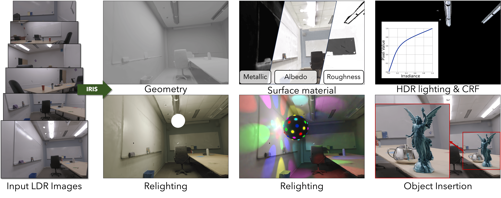

<h1 align="center"> 👁️ IRIS: Inverse Rendering of Indoor Scenes </br> from Low Dynamic Range Images</h1>
<p align="center"><b>CVPR 2025</b></p>
<p align="center"><a href="https://irisldr.github.io/" target="_blank">Project Page</a> | <a href="https://arxiv.org/abs/2401.12977" target="_blank">Paper</a> | <a href="https://uofi.box.com/s/q26vjzweu2fj7rb9aswfxdqrgxwq0uom" target="_blank">Data</a> | <a href="https://uofi.box.com/s/64aor3xxzovnnf879cley89op5dde9ir" target="_blank">Checkpoints</a></p>


<p align="center">
<a href="https://chih-hao-lin.github.io/" target="_blank">Chih-Hao Lin<sup>1,2</sup></a>, 
<a href="https://jbhuang0604.github.io/" target="_blank">Jia-Bin Huang<sup>1,3</sup></a>, 
<a href="https://scholar.google.com/citations?hl=zh-CN&user=Nxc2RbQAAAAJ&view_op=list_works&sortby=pubdate" target="_blank">Zhengqin Li<sup>1</sup></a>, 
<a href="http://flycooler.com" target="_blank">Zhao Dong<sup>1</sup></a>, 
<a href="https://richardt.name/" target="_blank">Christian Richardt<sup>1</sup></a>, 
</br>
<a href="https://scholar.google.com/citations?user=jGQeuBUAAAAJ" target="_blank">Tuotuo Li<sup>1</sup></a>, 
<a href="https://zollhoefer.com/" target="_blank">Michael Zollhöfer<sup>1</sup></a>,
<a href="https://johanneskopf.de/" target="_blank">Johannes Kopf<sup>1</sup></a>,
<a href="https://shenlong.web.illinois.edu/" target="_blank">Shenlong Wang<sup>2</sup></a>,  
<a href="https://changilkim.com" target="_blank">Changil Kim<sup>1</sup></a></p>

<p align="center"><sup>1</sup>Meta, <sup>2</sup>University of Illinois at Urbana-Champaign, <sup>3</sup>University of Maryland, College Park</p>



## Setup
The code has been tested on:
- **OS**: Ubuntu 22.04.4 LTS
- **GPU**: NVIDIA GeForce RTX 4090
- **Driver Version**: 535
- **CUDA Version**: 12.2
- **nvcc**: 11.7

Please install anaconda/miniconda and run the following script to set up the environment:
```bash
bash scripts/conda_env.sh
```
The package information details can be found in `environment.yml`.

## Dataset and Checkpoints
- Please download [datasets](https://uofi.box.com/s/q26vjzweu2fj7rb9aswfxdqrgxwq0uom) and edit the paths (`DATASET_ROOT`) in training/rendering scripts accordingly. We provide 8 scenes in total, including 2 real scenes from [ScanNet++](https://kaldir.vc.in.tum.de/scannetpp/) (`scannetpp/`), 2 real scenes from [FIPT](https://jerrypiglet.github.io/fipt-ucsd/) (`fipt/real/`), and 4 synthetic scenes from [FIPT](https://jerrypiglet.github.io/fipt-ucsd/) (`fipt/indoor_synthetic/`).
  - Geometry is reconstructed and provided for each scene.
  - While HDR images (`*.exr`) are not used by IRIS, they are also provided for FIPT scenes. 
- Please download [checkpoints](https://uofi.box.com/s/64aor3xxzovnnf879cley89op5dde9ir) and put under `checkpoints`. We provide checkpoints of all the scenes in the dataset.

## Training
The training scripts are `scripts/{dataset}/{scene}/train.sh`. For example, please run the following to train at `bathroom2` scene in ScanNet++:
```bash
bash scripts/scannetpp/bathroom2/train.sh
```
The hyper-parameters are listed in `configs/config.py`, and can be adjusted at the top of the scripts. The training contains several stages:

1. Bake surface light field (SLF), and save as `checkpoints/{exp_name}/bake/vslf.npz`:
```bash
python slf_bake.py --dataset_root $DATASET_ROOT --scene $SCENE\
        --output checkpoints/$EXP/bake --res_scale $RES_SCALE\
        --dataset $DATASET
```

2. Extract emitter mask, and save as `checkpoints/{exp_name}/bake/emitter.pth`:
```bash
python extract_emitter_ldr.py \
        --dataset_root $DATASET_ROOT --scene $SCENE\
        --output checkpoints/$EXP/bake \
        --dataset $DATASET --res_scale $RES_SCALE\
        --threshold 0.99 
```

3. Initialize BRDF and emitter radiance:
```bash
python initialize.py --experiment_name $EXP --max_epochs 5 \
        --dataset $DATASET $DATASET_ROOT --scene $SCENE \
        --voxel_path checkpoints/$EXP/bake/vslf.npz \
        --emitter_path checkpoints/$EXP/bake/emitter.pth \
        --has_part $HAS_PART --val_frame $VAL_FRAME\
        --SPP $SPP --spp $spp --crf_basis $CRF_BASIS --res_scale $RES_SCALE
```

4. Update emitter radiance:
```bash
python extract_emitter_ldr.py --mode update\
        --dataset_root $DATASET_ROOT --scene $SCENE\
        --output checkpoints/$EXP/bake --res_scale $RES_SCALE\
        --ckpt checkpoints/$EXP/init.ckpt\
        --dataset $DATASET
```

5. Bake shading maps, and save in `outputs/{exp_name}/shading `:
```bash
python bake_shading.py \
        --dataset_root $DATASET_ROOT --scene $SCENE  \
        --dataset $DATASET --res_scale $RES_SCALE\
        --slf_path checkpoints/$EXP/bake/vslf.npz \
        --emitter_path checkpoints/$EXP/bake/emitter.pth \
        --output outputs/$EXP/shading 
```

6. Optimize BRDF and camera CRF:
```bash
python train_brdf_crf.py --experiment_name $EXP \
        --dataset $DATASET $DATASET_ROOT --scene $SCENE\
        --has_part $HAS_PART --val_frame $VAL_FRAME --res_scale $RES_SCALE\
        --max_epochs 2 --dir_val val_0 \
        --ckpt_path checkpoints/$EXP/init.ckpt \
        --voxel_path checkpoints/$EXP/bake/vslf.npz \
        --emitter_path checkpoints/$EXP/bake/emitter.pth \
        --cache_dir outputs/$EXP/shading \
        --SPP $SPP --spp $spp --lp 0.005 --la 0.01 \
        --l_crf_weight 0.001 --crf_basis $CRF_BASIS
```

7. Refine surface light field:
```bash
python slf_refine.py --dataset_root $DATASET_ROOT --scene $SCENE \
        --output checkpoints/$EXP/bake --load vslf.npz --save vslf_0.npz \
        --dataset $DATASET --res_scale $RES_SCALE\
        --ckpt checkpoints/$EXP/last_0.ckpt --crf_basis $CRF_BASIS
```

8. Refine emitter radiance:
```bash
python train_emitter.py --experiment_name $EXP \
        --dataset $DATASET $DATASET_ROOT --scene $SCENE\
        --has_part $HAS_PART --val_frame $VAL_FRAME --res_scale $RES_SCALE\
        --max_epochs 1 --dir_val val_0_emitter \
        --ckpt_path checkpoints/$EXP/last_0.ckpt \
        --voxel_path checkpoints/$EXP/bake/vslf_0.npz \
        --emitter_path checkpoints/$EXP/bake/emitter.pth \
        --SPP $SPP --spp $spp --crf_basis $CRF_BASIS
```

9. Refine shading maps:
```bash
python refine_shading.py \
        --dataset_root $DATASET_ROOT --scene $SCENE  \
        --dataset $DATASET --res_scale $RES_SCALE\
        --slf_path checkpoints/$EXP/bake/vslf_0.npz \
        --emitter_path checkpoints/$EXP/bake/emitter.pth \
        --ckpt checkpoints/$EXP/last_0.ckpt \
        --output outputs/$EXP/shading
```

## Rendering & Relighting
The rendering scripts are `scripts/{dataset}/{scene}/render.sh`. For example, please run the following for `bathroom2` scene in ScanNet++:
```bash
bash scripts/scannetpp/bathroom2/render.sh
```
The scripts contain three parts:

1. Render train/test frames, including RGB, BRDF, and emission maps. The output is saved at `outputs/{exp_name}/output/{split}`:
```bash
python render.py --experiment_name $EXP --device 0\
        --ckpt last_1.ckpt \
        --dataset $DATASET $DATASET_ROOT --scene $SCENE\
        --res_scale $RES_SCALE\
        --emitter_path checkpoints/$EXP/bake\
        --output_path 'outputs/'$EXP'/output'\
        --split 'test'\
        --SPP $SPP --spp $spp --crf_basis $CRF_BASIS 
```
2. Render videos of RGB, BRDF, and emission maps. The output is saved at `outputs/{exp_name}/video`:
```bash
python render_video.py --experiment_name $EXP --device 0\
        --ckpt last_1.ckpt \
        --dataset $DATASET $DATASET_ROOT --scene $SCENE \
        --res_scale $RES_SCALE\
        --emitter_path checkpoints/$EXP/bake\
        --output_path 'outputs/'$EXP'/video'\
        --split 'test'\
        --SPP $SPP --spp $spp --crf_basis $CRF_BASIS 
```

3. Render relighting videos. The output is saved at `outputs/{exp_name}/relight`:
```bash
python render_relight.py --experiment_name $EXP --device 0\
        --ckpt last_1.ckpt --mode traj\
        --dataset $DATASET $DATASET_ROOT --scene $SCENE \
        --res_scale $RES_SCALE \
        --emitter_path checkpoints/$EXP/bake\
        --output_path 'outputs/'$EXP'/relight/video_relight_0'\
        --split 'test'\
        --light_cfg 'configs/scannetpp/bathroom2/relight_0.yaml' \
        --SPP $SPP --spp $spp --crf_basis $CRF_BASIS 
```
- The relighting config files are `configs/{dataset}/{scene}/*.yaml`, and are input for parameter `--light_cfg`, generating different relighting results.
- For object insertion, the emitter geometry and average radiance are extracted with `scripts/extract_emitter.sh`. The assets for insertion can be downloaded [here](https://uofi.box.com/s/qe5lhq5c9f49fq76y46o6qq7lay6gsw6) and put under `outputs`.

## Evaluation
The inverse rendering metric of FIPT synthetic scenes is calculated by (please modify the paths accordingly):
```bash
python -m utils.metric_brdf
```

## Customized Data
- The camera poses can be estimated with [NeRFstudio pipeline](https://docs.nerf.studio/quickstart/custom_dataset.html) (`transforms.json`).
- The surface albedo is estimated with [IRISFormer](https://github.com/Jerrypiglet/IRISFormer_beta), and can be replaced with [RGB-X](https://github.com/zheng95z/rgbx) for even better performance.
- Surface normal is estimated with [OmniData](https://github.com/EPFL-VILAB/omnidata) for geometry reconstruction, and can be replaced with more recent works for even better performance.
- Geometry is reconstructed with [BakedSDF](https://bakedsdf.github.io/) in [SDFStudio](https://github.com/autonomousvision/sdfstudio). We use [customized version](https://github.com/chih-hao-lin/sdfstudio/tree/master) and run the following:
```bash
# Optimize SDF
python scripts/train.py bakedsdf-mlp \
    --output-dir [output_dir] --experiment-name [experiment_name] \
    --trainer.steps-per-eval-image 5000 --trainer.steps-per-eval-all-images 50000 \
    --trainer.max-num-iterations 250001 --trainer.steps-per-eval-batch 5000 \
    --pipeline.model.sdf-field.bias 1.5 \
    --pipeline.model.sdf-field.inside-outside True \
    --pipeline.model.eikonal-loss-mult 0.01 \
    --pipeline.model.num-neus-samples-per-ray 24 \
    --machine.num-gpus 1 \
    --pipeline.model.mono-normal-loss-mult 0.1 \
    panoptic-data \
    --data [path_to_data] \
    --panoptic_data False --mono_normal_data True --panoptic_segment False \
    --orientation-method none --center-poses False --auto-scale-poses False

# Extract mesh
python scripts/extract_mesh.py --load-config [exp_dir]/config.yml \
    --output-path [exp_dir]/mesh.ply \
    --bounding-box-min -2.0 -2.0 -2.0 --bounding-box-max 2.0 2.0 2.0 \
    --resolution 2048 --marching_cube_threshold 0.001 \
    --create_visibility_mask True --simplify-mesh True
```

## License

IRIS is CC BY-NC 4.0 licensed, as found in the [LICENSE](LICENSE) file.

## Citation
If you find our work useful, please consider citing:
```bibtex
@inproceedings{lin2025iris,
  title     = {{IRIS}: Inverse rendering of indoor scenes from low dynamic range images},
  author    = {Lin, Chih-Hao and Huang, Jia-Bin and Li, Zhengqin and Dong, Zhao and
               Richardt, Christian and Li, Tuotuo and Zollh{\"o}fer, Michael and
               Kopf, Johannes and Wang, Shenlong and Kim, Changil},
  booktitle = {Conference on Computer Vision and Pattern Recognition (CVPR)},
  year      = {2025}
}
```

## Acknowledgements
Our code is based on [FIPT](https://jerrypiglet.github.io/fipt-ucsd/). Some experiment results are provided by the authors of [I^2-SDF](https://jingsenzhu.github.io/i2-sdf/) and [Li et al](https://vilab-ucsd.github.io/ucsd-IndoorLightEditing/). We thank the authors for their excellent work!
